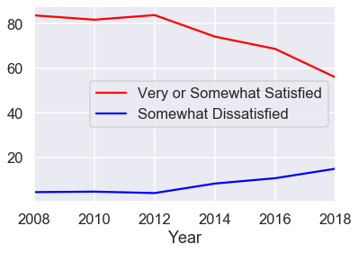

<div markdown="1" class="cell code_cell">
<div class="input_area" markdown="1">
```python
import pandas as pd
import numpy as np
%matplotlib inline
import matplotlib.pyplot as plt
#import plotly.plotly as py
#import plotly.graph_objs as go
import seaborn as sns
sns.set()
sns.set_context('talk')
np.set_printoptions(threshold=20, precision=2, suppress=True)
pd.options.display.max_rows = 7
pd.options.display.max_columns = 8
pd.set_option('precision', 2)


```
</div>

</div>


<div markdown="1" class="cell code_cell">
<div class="input_area" markdown="1">
```python
!ls .. -al

```
</div>

<div class="output_wrapper" markdown="1">
<div class="output_subarea" markdown="1">
{:.output_stream}
```
ls: -al: No such file or directory
..:
BART           data           features       intro.md
LICENSE.md     datajournalism images         notebooks
```
</div>
</div>
</div>


<div markdown="1" class="cell code_cell">
<div class="input_area" markdown="1">
```python
bartpop = pd.read_csv("../data/Customer Satisfaction_2018.csv")
bartpop

```
</div>

<div class="output_wrapper" markdown="1">
<div class="output_subarea" markdown="1">


<div markdown="0" class="output output_html">
<div>
<style scoped>
    .dataframe tbody tr th:only-of-type {
        vertical-align: middle;
    }

    .dataframe tbody tr th {
        vertical-align: top;
    }

    .dataframe thead th {
        text-align: right;
    }
</style>
<table border="1" class="dataframe">
  <thead>
    <tr style="text-align: right;">
      <th></th>
      <th>Year</th>
      <th>Very Satisfied</th>
      <th>Somewhat Satisfied</th>
      <th>Neutral</th>
      <th>Somewhat Dissatisfied</th>
      <th>Very Dissatisfied</th>
      <th>Missing</th>
      <th>Very or Somewhat Satisfied</th>
    </tr>
  </thead>
  <tbody>
    <tr>
      <th>0</th>
      <td>2008</td>
      <td>42.33</td>
      <td>41.48</td>
      <td>10.39</td>
      <td>4.45</td>
      <td>0.97</td>
      <td>0.38</td>
      <td>83.82</td>
    </tr>
    <tr>
      <th>1</th>
      <td>2010</td>
      <td>36.08</td>
      <td>45.78</td>
      <td>12.27</td>
      <td>4.68</td>
      <td>0.88</td>
      <td>0.31</td>
      <td>81.86</td>
    </tr>
    <tr>
      <th>2</th>
      <td>2012</td>
      <td>39.70</td>
      <td>44.24</td>
      <td>10.73</td>
      <td>4.04</td>
      <td>0.96</td>
      <td>0.33</td>
      <td>83.94</td>
    </tr>
    <tr>
      <th>3</th>
      <td>2014</td>
      <td>28.23</td>
      <td>46.04</td>
      <td>14.51</td>
      <td>8.32</td>
      <td>2.32</td>
      <td>0.59</td>
      <td>74.27</td>
    </tr>
    <tr>
      <th>4</th>
      <td>2016</td>
      <td>23.53</td>
      <td>45.23</td>
      <td>16.82</td>
      <td>10.71</td>
      <td>3.28</td>
      <td>0.43</td>
      <td>68.76</td>
    </tr>
    <tr>
      <th>5</th>
      <td>2018</td>
      <td>15.89</td>
      <td>40.11</td>
      <td>22.40</td>
      <td>14.97</td>
      <td>6.27</td>
      <td>0.36</td>
      <td>56.00</td>
    </tr>
  </tbody>
</table>
</div>
</div>


</div>
</div>
</div>


<div markdown="1" class="cell code_cell">
<div class="input_area" markdown="1">
```python
ax= plt.gca()

bartpop.plot(kind='line',x="Year",y="Very or Somewhat Satisfied", color='red', ax=ax)
bartpop.plot(kind='line',x="Year",y="Somewhat Dissatisfied", color='blue', ax=ax)

plt.show()

```
</div>

<div class="output_wrapper" markdown="1">
<div class="output_subarea" markdown="1">

{:.output_png}


</div>
</div>
</div>

